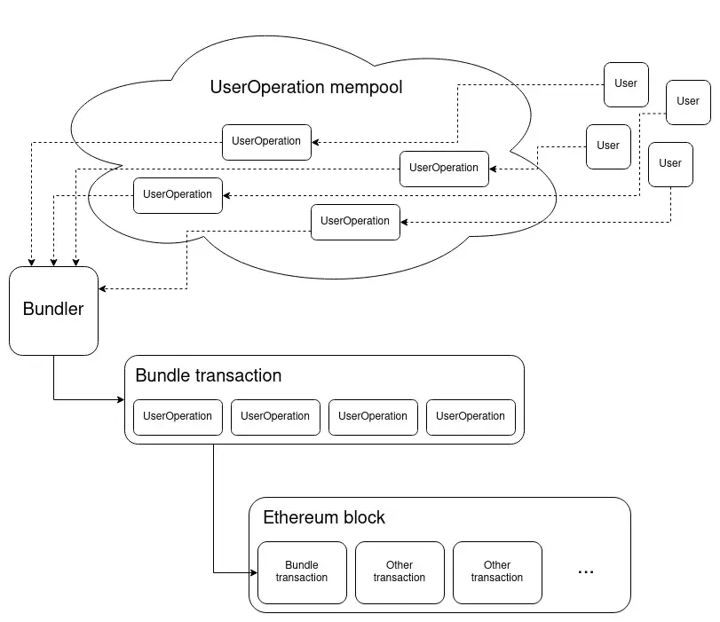
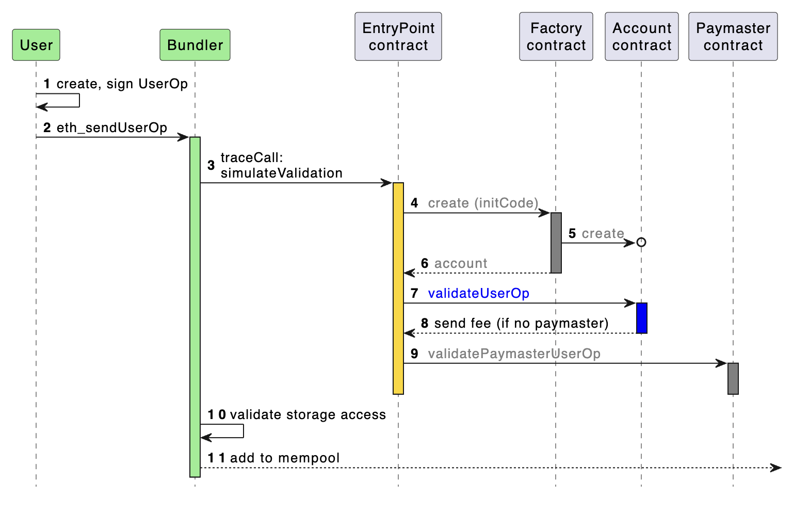

# Account Abstraction


The implementation of account abstraction is work in progress. The details provided here are subject to change as development progresses.


## TL;DR

Account abstraction transforms traditional blockchain wallets by making them programmable through smart contract wallets. It abstracts the transaction-signing process, significantly enhancing user experience and security. This innovation aims to onboard a broader audience from Web2 to Web3 by normalizing blockchain interactions.


For hands-on exploration of account abstraction, refer to our [account-abstraction.md](../../start-building/tutorials/account-abstraction.md "mention") guide.


## Introduction

Account abstraction is a new approach to make blockchain accounts programmable through smart contract wallets. To understand its significance, it's essential to grasp how users currently interact with blockchains.

### Traditional Blockchain Interaction: Externally Owned Accounts (EOAs)

Most of the interaction with a blockchain, including VeChain, are initiated by externally owned account (EOA) through non-custodial wallets. People need to sign a transaction with their private key to spend their money. Possession of the private key grants control over the wallet’s assets, that once lost can't be recovered. 
Since it was error prone to write down a long hex string, a mnemonic seed phrase (mnemonic in brief) is usually the information that needs to be stored off-line in a safe location. 
A mnemonic is a set of words representing a random point on a cryptographic curve, usually 12 or 24, from which the key pair can be derived. The EOA will be created at the first usage. 
Just like with the pure private key, losing this seed phrase can result in permanent loss of access. 
This seed phrase is used to generate the private key, which is then used to sign transactions. Each and every blockchain transaction requires a signature proving to the blockchain that the user has initiated the transaction from its account. Examples of non-custodial wallets are VeWorld and MetaMask.

### Limitations of EOAs

EOAs come with several drawbacks:

 * Lack of programmability/flexibility.
 * Poor user experience due to manual transaction signing.
 * Security risks due to the private key being unique point of failure with no recourse.

### The Solution: Account Abstraction

Smart contract wallets offer an improved user experience by abstracting the signing of transactions which will offer a dramatic increase in the user experience. Abstracting away the necessity to sign each and every transaction combined with features such as trusted sessions and batch transactions will transform the blockchain user experience.

Smart contract wallets also offer improved security through the ability to flexibly incorporate account recovery methods. Security improvements such as multisig authorization, sharing account security across devices or individuals and the use of whitelists to protect users accounts, just to name a few potential candidates.

Currently, the user experience and improved security benefits are not natively supported as only EOAs can initiate transactions. Account abstraction paves the way for smart contracts to initiate transactions, allowing users to code their desired logic directly into the smart contract wallet for execution on the blockchain.

## How Account Abstraction Works

Account abstraction formalized through ERC-4337 introduces new participants, contracts, and data structures. If you wish to read more on how it works the following resources are a good starting point:

* [ERC-4337 Documentation](https://www.erc4337.io/docs)
* [Official ERC-4337 Ethereum Site](https://eips.ethereum.org/EIPS/eip-4337)

<figure><figcaption>
Diagram from <a href="https://www.erc4337.io/docs">erc4337.io/docs</a>
</figcaption></figure>

### Key Participants

Account abstraction introduces new participants:

* **Users**: Individuals/entities owning EOAs that interact with the blockchain through `UserOperations`.
* **Bundlers**: Nodes that package `UserOperations` from a public mempool into transactions for execution.
* **Paymasters**: Optional actors that sponsor transaction fees, enabling innovative mechanisms for fee payment.
* **Aggregators**: Optimize transactions by compressing multiple signatures into one, reducing costs.

### Key Smart Contracts

Account abstraction introduces several new smart contracts. These smart contracts and their roles are briefly described below:

* **EntryPoint Contract:** A central contract that verifies and executes bundled `UserOperations`.
* **Account Factory Contract:** Responsible for creating smart contract wallets.
* **Account Contract:** Represents a user’s programmable wallet.
* **Paymaster Contract:** Optionally facilitates transaction fee sponsorship.

### Key Data Structure

Account abstraction introduces a new data structure:

* **UserOperation:** A data object representing a user’s intent to perform a blockchain transaction. It includes details like transaction type, associated smart contracts, and execution logic. A UserOperation is sent from a User via a Client to a Bundler. The Bundler then converts the UserOperation into a transaction.

### ERC-4337 Workflow Overview

There are several participants and smart contracts involved in the account abstraction flow. Ultimately, the objective is to convert UserOperations into transactions through the ERC-4337 standards.

From the diagram below we can see that the first actor is a User who initiates a UserOperation. A UserOperation is a pseudo-transaction object which represents the Users intent to perform a transaction. An example of a UserOperation could be instructions to deploy a new Account contract, send a token or make a contract call.

The UserOperation is sent to a Bundler. The Bundler is an actor that packages UserOperations from a public mempool into a transaction which is sent to the EntryPoint contract on the blockchain for execution. The Bundler is a node and is rewarded for their work through a fee which is paid by the User to the Bundler.

The EntryPoint contract is the smart contract that handles the verification and execution logic of transactions. The EntryPoint contract interacts with the Account contract of the user. The purpose of this interaction is to verify the UserOperation and process the transaction.

There are some additional actors that we have not yet discussed. The Account Factory contract is a contract that is called when using a wallet for the first time. This is represented in a UserOperation through the `initCode` field which is used to specify the creation of a smart contract wallet. A Paymaster contract is an optional actor that can sponsor gas fees for smart contract wallets. An Aggregator is another actor, which is not represented on the image below, that can be used to compress multiple signature into a single signature with the purpose of minimising transaction fees.

<figure><figcaption>
Architecture from <a href="https://www.erc4337.io/docs/understanding-ERC-4337/architecture">erc4337.io/docs</a>
</figcaption></figure>
