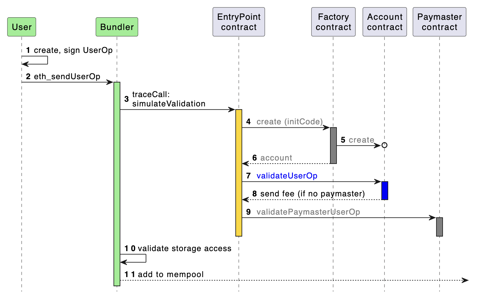

# Account Abstraction


The implementation of account abstraction is work in progress. Hence, this material is subject to change.


## TL;DR

Account abstraction enhances the functionality of existing smart contract wallets, which make blockchain accounts programmable. The name, account abstraction, refers to the logic of removing the signing of transactions from the account and abstracting it out. Smart contract wallets offer a better user experience and improved security. Smart contract wallets are expected to be the approach for normalising and onboarding vast amounts of users from Web2 into Web3.


For hands on experience with account abstraction and Thor Solo see our [account-abstraction](../../developer-resources/tutorials/account-abstraction/ "mention") guide.


## Introduction

Account abstraction is a new approach to make blockchain accounts programmable through smart contract wallets. To understand account abstraction we must first understand how users currently interact with a blockchain.

Currently, all interactions on all blockchains, including vechain, are initiated through an externally owned account (EOA). EOAs are wallets owned by users and operated manually from outside the blockchain. They are controlled and managed through a public-private key pair. Whoever owns the private key owns the assets stored in the EOA. The most crucial part of an EOA is its seed phrase. The seed phrase is a set of random words, usually 24, that is generated when the EOA is being setup. This seed phrase is used to generate the private key, which is then used to sign transactions. Each and every blockchain transaction requires a signature on a transaction proving to the blockchain that the user has initiated the transaction from their account. Examples of EOAs are Coinbase Wallet and MetaMask.

The EOA design is inflexible, lacks programmability, provides a poor user experience and makes the user vulnerable to attack through poor private key management. Account abstraction offers a solution to these restrictions.

## Advantages of Smart Contract Wallets

Smart contract wallets offer an improved user experience by abstracting the signing of transactions which will offer a dramatic increase in the user experience. Abstracting away the necessity to sign each and every transaction combined with features such as trusted sessions and batch transactions will transform the blockchain user experience.

Smart contact wallets also offer improved security through the ability to flexibly incorporate account recovery methods. Security improvements such as multisig authorization, sharing account security across devices or individuals and the use of whitelists to protect users accounts, just to name a few potential candidates.

Currently, the user experience and improved security benefits are not natively supported as only EOAs can initiate transactions. Account abstraction paves the way for smart contracts to initiate transactions, allowing users to code their desired logic directly into the smart contract wallet for execution on the blockchain.

## How Account Abstraction Works

Account Abstraction is formalized through ERC-4337. If you wish to read more on how it works the following resources are a good starting point:

* [ERC-4337 Documentation](https://www.erc4337.io/docs)
* [Official ERC-4337 Ethereum Site](https://eips.ethereum.org/EIPS/eip-4337)

### ERC-4337: Actors

Account abstraction introduces several new participants. These participants can have smart contracts representing them on chain or an EOA or both. The new participants and their roles are briefly described below:

1. **Users**: Individuals/Entities that own EOAs, interact with the Bundler and generate userOperations.
2. **Bundlers**: Nodes responsible for including UserOperations in a block. They must ensure that earlier transactions in the block don't make any UserOperation fail and must follow the rules specified in the proposal.
3. **Paymasters**: Deploy the Paymaster contract that facilitates transaction sponsorship, allowing third-party designed mechanisms to pay for transactions. Paymasters enable passive transaction sponsorship. Paymasters are an optional actor and are not a necessity.

### ERC-4337: Contracts

Account abstraction introduces several new smart contracts. These smart contracts and their roles are briefly described below:

1. **EntryPoint Contract:** A singleton entry point smart contract that handles the verification and execution of bundles of UserOperations.
2. **Account Factory Contract:** A non uniform smart contract that is used to create Account contracts on a given blockchain network.
3. **Account Contract:** A smart contract that represents the user's account on a given blockchain network.
4. **Paymaster Contract:** An optional contract that is deployed by individuals which facilitates the sponsorship of transaction fees.

### ERC-4337: Components

Account abstraction introduces a new data structure which is briefly described below:

1. **UserOperation:** The key data structure of account abstraction which represents the Users intent to perform a transaction. A UserOperation is sent from a User via a Client to a Bundler. The Bundler then converts the UserOperation into a transaction.

### ERC-4337: Flow Overview

There are several participants and smart contracts involved in the account abstraction flow. Ultimately, the objective is to convert UserOperations into transactions through the ERC-4337 standards.

From the diagram below we can see that the first actor is a User who initiates a UserOperation. A UserOperation is a pseudo-transaction object which represents the Users intent to perform a transaction. An example of a UserOperation could be instructions to deploy a new Account contract, send a token or make a contract call.

The UserOperation is sent to a Bundler. The Bundler is an actor that packages UserOperations from a public mempool into a transaction which is sent to the EntryPoint contract on the blockchain for execution. The Bundler is a node and is rewarded for their work through a fee which is paid by the User to the Bundler.

The EntryPoint contract is the smart contract that handles the verification and execution logic of transactions. The EntryPoint contract interacts with the Account contract of the user. The purpose of this interaction is to verify the UserOperation and process the transaction.

There are some additional actors that we have not yet discussed. The Account Factory contract is a contract that is called when using a wallet for the first time. This is represented in a UserOperation through the `initCode` field which is used to specify the creation of a smart contract wallet. A Paymaster contract is an optional actor that can sponsor gas fees for smart contract wallets. An Aggregator is another actor, which is not represented on the image below, that can be used to compress multiple signature into a single signature with the purpose of minimising transaction fees.

<figure><figcaption>
Photo taken from <a href="https://www.erc4337.io/docs/understanding-ERC-4337/architecture">erc4337.io</a>
</figcaption></figure>
