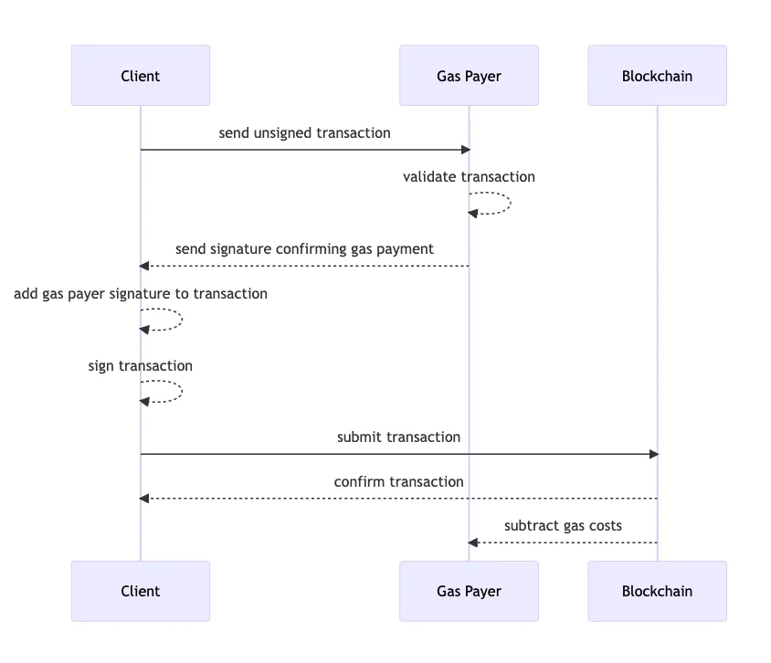

# Designated Gas Payer (VIP-191)

## Introduction <a href="#designated-gas-payer-vip191-2" id="designated-gas-payer-vip191-2"></a>

The designated gas payer is a standard which has been implemented on the VeChainThor blockchain, through VIP-191, which extends the MPP functionality in a more flexible way. VIP-191, allows a transaction sender to seek for an arbitrary party, the gas payer, to pay the transaction fee on the sender's behalf. An example of VIP-191 implementation could be to implement a transaction fee gas payer for users that are performing a particular action such as minting an NFT at an event or awarding the highest points scorer on a game with sponsored transactions.


See [here](https://github.com/vechain/VIPs/blob/master/vips/VIP-191.md) for the VIP documentation and implementation relating to VIP-191.


## Description and Flow

The protocol requires that both the transaction sender and the fee delegation gas payer put their digital signatures in the transaction. In order for the fee delegation to be activated the sender needs to opt into using VIP-191. Once the transaction is accepted and executed, the transaction fee will be deducted from the gas payer's VTHO balance.

Before we continue let's define some entities and terminology that we will use as we continue our journey of understanding the VIP-191 standard:

* client - account that signs the transaction;
* gas payer - account that acts as the gas payer of the transaction fee;
* blockchain - the VeChainThor blockchain;

<figure><figcaption><p>VIP-191 fee delegation flow.</p></figcaption></figure>

The above figure shows the decision-making flow within VIP-191. When it comes to the question of who pays for the transaction fees, first the client will send an unsigned transaction to the gas payer which will determine if the client is permitted to avail of the gas payer's VTHO sponsorship. Gas payers are configurable to ensure that a gas payer's services are only used for their intended fee delegation purpose, see the [VIP-191 standard](https://github.com/vechain/VIPs/blob/master/vips/VIP-191.md#example-usage) for further implementation detail. If the client's transaction meets the gas payer's criteria the gas payer will return a signature to the client who will then add the gas payer's signature and the client's signature to the transaction. The transaction will be submitted to the blockchain and the transaction fee will be paid by the gas payer.

As an example, let's assume there is a marketplace which has enabled VIP-191 and a user is making a purchase. The route of who is going to pay the transaction fee is such. If the user is on the list of user accounts whose fees can be delegated through the marketplace VIP-191 gas payer and the marketplace gas payer has a sufficient VTHO balance and is online the transaction fee will be paid by the gas payer. Otherwise, if the gas payer is offline or the gas payer has insufficient VTHO balance the transaction will fail.

### Transaction Model Extension <a href="#tx-model-extension" id="tx-model-extension"></a>

The field `Reserved` in the transaction body structure has been redefined to be an object as shown below:

```go
type reserved struct {
	Features Features
	Unused   []rlp.RawValue
}
```

Within the structure, we define the field `Features` as 32-bit unsigned integer. We can think of it as a bitmap. Each bit marks the status (1 for on and 0 for off) of a particular feature. For VIP-191, the least significant bit is used.

Recall that VIP-191 requires two valid signatures to be included in the transaction. In practice, the transaction sender's signature is concatenated with the gas-payer's signature and assigned to the field `Signature` as usual. Moreover, the protocol requires the gas-payer to sign the $$TxID$$ which is a unique identifier of the transaction.

### Gas Payer Deciding Logic <a href="#gas-payer-deciding-logic" id="gas-payer-deciding-logic"></a>

The gas payer deciding logic brought by VIP-191 is added in the function `BuyGas` in the Go source file `THORDIR/runtime/resolved_tx.go`.

```go
if r.Delegator != nil {
	if energy.Sub(*r.Delegator, prepaid) {
		return baseGasPrice, gasPrice, *r.Delegator, func(rgas uint64) { doReturnGas(rgas) }, nil
	}
	return nil, nil, thor.Address{}, nil, errors.New("insufficient energy")
}
```

It can be seen that the system first checks whether there is a designated gas payer (`r.Delegator`). If there is a gas payer, the system will try to deduct the transaction fee from the gas payer's VTHO balance. If the balance is too low, the system will stop processing the transaction and return an error. Otherwise, the system will mark the gas payer in the runtime context associated with the transaction and pass on the context to the code that executes individual clauses.


Use the vechain.energy fee delegation service to easily create a gas payer, see [here](https://blog.vechain.energy/how-to-setup-fee-delegation-for-vechain-9ac9fef31455) for more information.



A useful article with a demo implementation is available [here](https://peter-zhou.medium.com/what-you-might-not-know-about-vechainthor-yet-part-iii-transaction-fee-delegation-vip-191-4ee71d690f1b).

