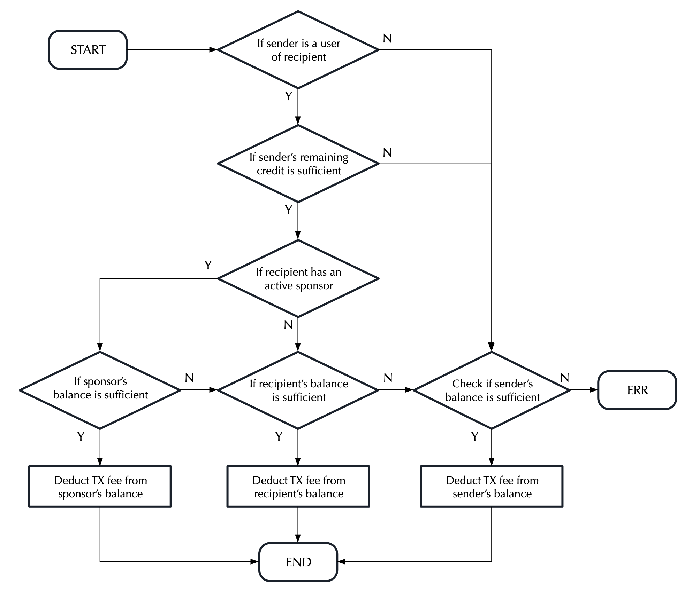

# Multi-Party Payment (MPP)

## Introduction <a href="#multi-party-payment-prototype-2" id="multi-party-payment-prototype-2"></a>

MPP is a native protocol on the VechainThor blockchain. MPP enables the sender of a transaction to request that the sponsor or receiver of the transaction pays the transaction fee on the senders behalf. MPP is a fee delegation approach which is implemented on the smart contract level. This means that data must be written on-chain, which comes at a cost. It is more cost effective to use the MPP protocol for frequent interactions between users and a decentralized application (dApp). An example of MPP implementation could be a marketplace or game which has opted to pay for all users transaction fees.

## Description and Flow

In practice, a dApp is most likely comprised of multiple smart contracts deployed on the VechainThor blockchain. With MPP, a dApp owner can register its users' accounts as the user of the smart contracts such that all legitimate transactions from the dApp users can be paid by the smart contract owner. In this way, people can use the dApp almost in the same way they use other apps without dealing with crypto. Moreover, the owner can set up a single account to sponsor all of the smart contracts which together make the dApp, which makes the maintenance a lot easier.

Before we continue lets define some entities and terminology that that we will use as we continue our journey of understanding the MPP protocol:

* sender - account that signs the transaction;
* recipient - account to which the transaction is sent;
* sponsor - account that sponsors the recipient to pay for the transaction fee;
* user - VechainThor allows any account to register other accounts as its users and conditionally pay for the cost of the transactions sent them;
* credit - available VTHO for paying for transaction cost for a particular user of a particular account.

<figure><figcaption><p>MPP fee delegation flow</p></figcaption></figure>

The above figure shows the decision-making flow within MPP. When it comes to the question of who pays for the transaction fees, the protocol first checks if the sender of the transaction is on the list of users and whether the contract being interacted with has a sponsor associated with the recipient. The protocol then tries to deduct the transaction fee from the corresponding account.&#x20;

As an example, let's assume there is a marketplace which has enabled MPP and a user is making a purchase. The route of who is going to pay the transaction fee is such. If the user is on the list of user accounts who's fees can be delegated through MPP and the marketplace has a fee delegation sponsor in place, the protocol will first try to deduct the transaction fee from the sponsor’s balance, if it fails, from the recipient's balance, the marketplace in this instance, and if it fails again, from the sender’s balance.

## Credit Plan <a href="#credit-plan" id="credit-plan"></a>

To prevent MPP from being abused by malicious users, the owner of a smart contract can set a credit plan for the smart contract to set up rules on how to pay for a sender's transaction fee. A credit plan can be defined as:

```go
type creditPlan struct {
	Credit       *big.Int
	RecoveryRate *big.Int
}
```

Where `RecoveryRate` is the amount of VTHO (in Wei) accumulated per block to pay for transactions for each user and `Credit` is the maximum amount of VTHO (in Wei) that can be accumulated.

When the system checks whether an account's user has a sufficient amount of credit to pay for the transaction, it calculates the available credit  as:

$$c = min(C, C - c_{used} + r \cdot max(0,h-h_0))$$

where $$C$$ denotes `Credit`,  $$r$$`RecoverRate`, $$h$$ the current block height, $$h_0$$ the block height when the user used credit last time and $$c_{used}$$ the amount of credit consumed after the user's last transaction is paid by the account. Note that $$C - c_{used}$$ is the remaining credit after the last transaction is paid.

## Master Account <a href="#master-account" id="master-account"></a>

In VechainThor, we introduce the concept of the master account to make it easier for dApp owners to user MPP and manage their dApps. Every account, including a smart contract, can have a master account which is allowed by the system to register / remove users, set a credit plan and select the active sponsor for an account. Note that the account that deploys a smart contract becomes the master of the contract by default. A normal account can also set it's master by calling the function `setMaster` implemented in the built-in contract `Prototype`.

In practice, a dApp is often comprised of multiple smart contracts and not just a single smart contract. Each smart contract may have its own users and be sponsored by multiple sponsors. Managing these sponsor accounts suddenly becomes a challenging task for the dApp owner. With the master mechanism and built-in contract `Prototype`, the dApp owner does not have to implement anything on the contract code level to use MPP. The dApp owner can use a single master to manage all the contracts by calling functions of the smart contract `Prototype`.

## MPP Implementation <a href="#mpp-implementation" id="mpp-implementation"></a>

The multi-party payment protocol is implemented by the built-in smart contract `Prototype` deployed at `0x000000000000000000000050726f746f74797065` in the genesis block of the VechainThor blockchain.


The MPP implementation is available here [#prototype-sol](../../../../developer-resources/built-in-contracts.md#prototype-sol "mention")


### **Functions related to user**

`isUser`

Check whether an account is a registered user of another account.

Input:

* `address _self`: account address
* `address _user`: _User_ address

Return:

* `true` if `_user` is a _User_ of `_self` or `false` otherwise

***

`addUser` / `removeUser`

Add / remove a user for an account. The transaction sender has to be the account itself or its current master.

Input:

* `address _self`: account address
* `address _user`: _User_ address

### **Functions related to the credit plan**

`creditPlan`

Get the credit plan associated with an account.

Input:

* `address _self`: account address

Return:

* `uint256 credit`: maximum amount of credit (VTHO in wei) allowed for each user of the account
* `uint256 recoveryRate`: amount of credit (VTHO in wei) generated per block for each user of the account

***

`setCreditPlan`

Set a credit plan for an account. The transaction sender has to be either the account itself and its current master.

Input:

* `uint256 credit`: maximum amount of credit (VTHO in wei) allowed for each user of the account
* `uint256 recoveryRate`: amount of credit (VTHO in wei) generated per block for each user of the account

***

`userCredit`

Get the available credit for a particular user of an account.

Input:

* `address _self`: account address
* `address _user`: user address

Return:

* `uint256`: available credit (VTHO in wei) for the user

### **Functions related to master**

`master`

Get the master address of the given account address.

Input:

* `address _self`: account address

Return:

* `address`: address of the master of `_self`.

***

`setMaster`

Set the master for a particular account. The transaction sender has to be either the account itself or its current master.

Input:

* `address _self`: account address
* `address _newMaster`: address of the new master of `_self`

### **Functions related to sponsor**

`sponsor` / `unsponsor`

Sponsor / unsponsor an account. The transaction sender has to be the sponsor account.

Input:

* `address _self`: address of the account to be sponsored / unsponsored

***

`isSponsor`

Check whether an input account is a sponsor of another account.

Input:

* `address _self`: account address
* `address _sponsor`: sponsor address

Return:

* `true` if `_sponsor` is a sponsor of `_self`

***

`selectSponsor`

Select a sponsor. The transaction sender has to be either the sponsored account or its master.

Input:

* `address _self`: account address
* `address _sponsor`: sponsor address

***

`currentSponsor`

Get the current active sponsor.

Input:

* `address _self`: account address

Return:

* `address`: address of the current active sponsor of `_self`.
