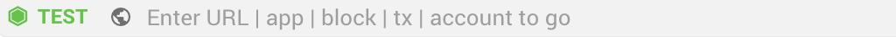

# Browser dApps and web

## Network's Name 

There is a tag shown before the node's name and network status which displays the network

* **MAIN** / **TEST** / **SOLO** / **UNKNOWN**

> TIP
>
> * SOLO is standalone mode
> * UNKNOWN is a network which is not official listed

## Network Status 

There are three colors show the network status :

1. Green : The node is synced
2. Orange  : The node is syncing
3. Red  : The node is out of sync

### Connect to a Node 

1.  Click on the network ,at left of the address bar(it shown the network MAIN/TEST/SOLO/UNKNOWN)&#x20;

    <figure><figcaption></figcaption></figure>
2. Select the node you would like to connect

For more information about node management, please visit [here](settings.md#node-management)

### Go to dApps or Websites 

1.  At the top center, input the website/dApps name or URL in the address bar&#x20;

    <figure><figcaption></figcaption></figure>
2. Pick a suggestions/recently visited, or press Return/Enter to go directly to the address you typed.

### Open New Tab 

At the top of the window, next to the last tab on the right, click  to open new tab

### Shortcuts 

* Add new shortcut
  1. At right of the address bar , Click 
  2. Click **Add shortcut**" to confirm.If you want to dismiss the action, you can click anywhere to cancel the action
* Remove shortcut
  1. In dApp/website
     1. At right of the address bar , Click 
     2. Click **Remove shortcut**" to confirm.If you want to cancel, you can click anywhere to cancel the action
  2. In homepage
     1. Move-over your pointer to the shortcut which you want to remove and wait for a second.
     2. Click the  at top right
     3. Click **REMOVE**
* Edit shortcut's name
  1. Move-over your pointer to the shortcut which you want to edit
  2. Click the  at top right
  3. Input the name which you would like to name the shortcut
  4. Click **SAVE** to finished the editing.
