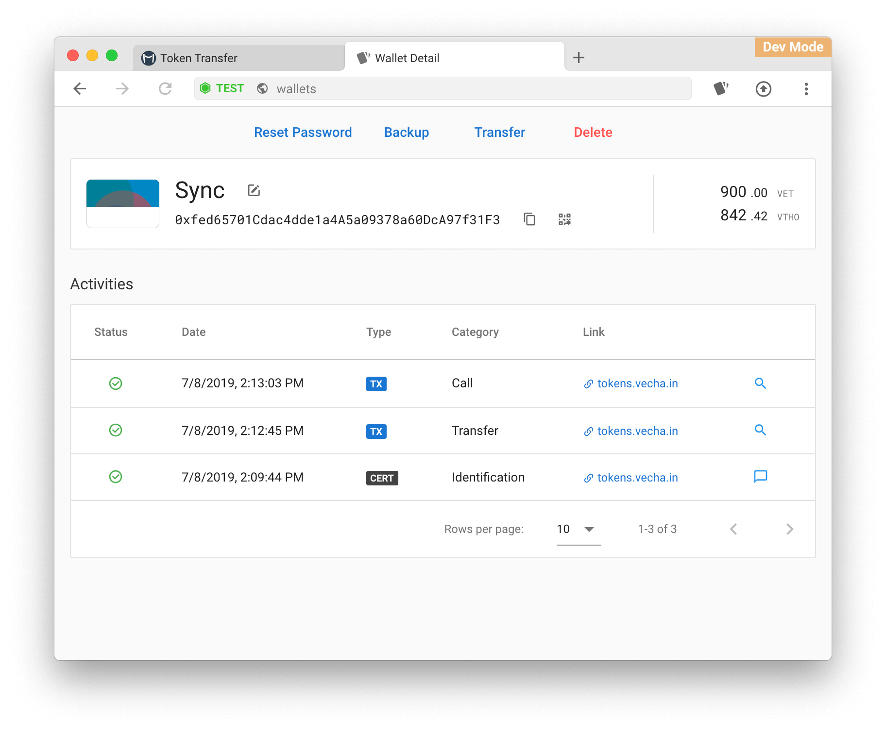

# Wallet

## Create Wallet 

1. On your computer, open Sync
2. At top right, click  , it will direct to wallet app
3. At the top, click **New**
4. Fill in fields to create your wallet
5. Write down the mnemonic words
6. Verify the mnemonic words


Backup your mnemonic words in a secure manner, preferably offline.


## Import Wallet 

1. On your computer, open Sync
2. At top right, click  , it will direct to wallet app
3. At the top, click **Import**
4. Select a method to import
5. Once the information verified, you can fill in fields to import your wallet

More : [Import from Ledger](ledger-device.md)

## Wallet Security 


Always keep your mnemonic safe and do not share your mnemonic with third parties. Do not store your mnemonic online. If you lose your mnemonic you lose your funds.


### Export Mnemonic 

1. On your computer, open Sync
2. At top right, click  , it will direct to wallet app
3. Click the wallet you which needs to export the key store
4. Click **Backup**
5. Enter the wallet password to continue process
6. Copy the mnemonic or export it to the custom path

### Reset Password 

You can change your wallet's name and password after wallet's password verified.

1. On your computer, open Sync
2. At top right, click  , it will direct to wallet app
3. Click the wallet you which needs to change the password
4. Click **Reset Password**
5. Enter the wallet password to continue process
6. Enter New password and click save

### Wallet Recovery 

1. On your computer, open Sync
2. At top right, click  , it will direct to wallet app
3. At the top, click **Import**
4. Select a method to import
5. Once the information verified, you can fill in fields to import your wallet

## Wallet Activity 

<figure><figcaption></figcaption></figure>

### Transaction 

* Date : Show the date which you signed the transaction.
* Status : There are 4 status of a transaction
  1. **Sending** : After signing a transaction , sync will send the signed transaction to node. If the transaction can not be sent , you can click to resend.
  2. **Confirming** : The transaction is confirming.
  3. **Confirmed** : The transaction is confirmed.
  4. **Dropped** : The transaction is expired, cannot be resent.
* Category: Transfer / Call / Create
* Link : Application URL.
* Action : Reveal transaction in insight.

### Certificate 

* Date : Show the date which you signed the transaction.
* status : Always (Only signed certificated will be recorded.)
* Category: Transfer / Call / Create
* Link : Application URL.
* Action : Reveal transaction in insight.
