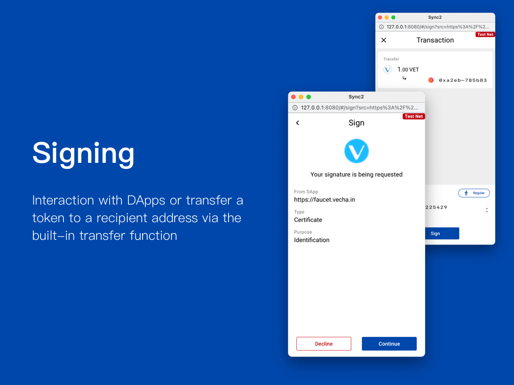

# Signing

<figure><figcaption></figcaption></figure>

## Content type 

There are two major types of signing contents:

| Type        | Purpose                                       |
| ----------- | --------------------------------------------- |
| Transaction | **Create** / **Transfer** / **Contract Call** |
| Certificate | **Identification** / **Agreement**            |


Sync2 would not provide the list of your address unless you sign the certificate of identification. Moreover, it only provides the address you've signed to dApp rather than all the addresses.


## Signing steps 

### 1. Confirm the request source External Request 

Sync allows users to choose your browser to interact with dApp. Therefore, It is a behaviour that the browser requesting Sync2 as a signature provider. Once Sync2 receives the signing content, please verify the below contents to continue the signing process.

* **From**： It shows the requested dApp URL
* **Type**: It show the requested type of singing (Transaction / Certificate )
* **Purpose**: If it's a singing request of the certificate, it indicates the purpose of Identification or Agreement
* **Summary**: Description of transaction
* **Network**: If there's no network appear, it means that the transaction is mainnet based. Otherwise, it will show the network identifier at the upper right

### 2. Review the signing content 

#### **A. Transaction content**

1. Check the **To** address is correct
2. Check the **Value** is correct
3. Check the **Data** if it appears
4. Check the Summary of the clause.

#### **B. Certificate content**

1. Check the Certificate type (Identification / Agreement)
2. Read carefully the message the dApp provided.

#### **Check if an error occurred**

Sync will check several things before the user signing.

1. Check the balance is sufficient
2. Check if there is an error occur during the compute in VM (virtual machine).
3. Check the content is valid

If there's an error, you can see there is a warning box above the adjustment area. Pay attention to transaction details before signing. Note that errors may cause the transaction to revert, or may deduct your VTHO due to it costs the VM to computed the transaction. Secondly, it will ask your permission to continue to sign the transaction before the authenticator.

#### **Change signer**

If you own more than one address and did not designate the signer, you can select an address to sign the transaction.

1. If transaction allows you to change the signer
2. Click the address to view all the wallets under the requested network
3. Click the address to become a signer

#### **Adjust priority**

Priority is a human-readable term of the Gas Price coefficient. Sync2 offer three different priority to user. user can adjust the priority (offer higher gas price for the packer to pack your transaction)

* Regular : **1x** of estimate VTHO cost
* Medium : **\~1.5x** of _Regular_ VTHO cost
* High : **2x** of _Regular_ VTHO cost

### 3. Confirm to sign 

Due to the nature of blockchain, transactions cannot be canceled or altered once they are initiated. Therefore, you must **ALWAYS review the signing content before signing.**

1. Click **Sign**
2. If an error occurred, please read the error before continue or terminate the signing process
3. Approve signing:
   1. **Password**: Enter your password to authorize the signing
   2. **Ledger User**: follow the signing steps and confirm the signing on your Ledger device

### 4. Check the result 

Once the transaction/ certificate is signed, you can check the result in [activities](activities.md)
