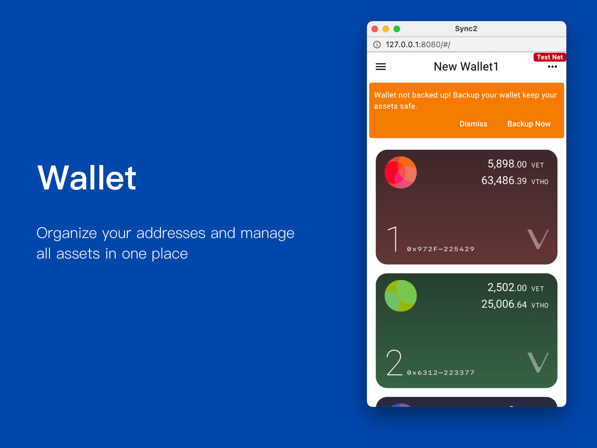

# Wallet

<figure><figcaption></figcaption></figure>

## Wallet list 

All the wallets will be shown in  wallet list.


If it is a Ledger wallet, you can identify the wallet by the presence of the 


## New Wallet 

### Generate 

1. Click upper left  to open wallet list
2. Click the upper area  to new wallet page
3. Click **Generate**
4. Verification
   1. Password: Enter your password to authorize the generation
   2. Biometric authentication:
      1. Facial recognition: hold your device in portrait orientation, then glance at it.
      2. Fingerprint recognition: place your finger on fingerprint scanner


Mobile - Long press the **Generate**

Desktop - Right click the **Generate**


### Import 

1. Click upper left  to open wallet list
2. Click the upper area  to new wallet page
3. Click **Import**
4. Enter your mnemonic words
5. Enter your password to authorize the import

### Link Ledger device 

1. Click upper left  to open wallet list
2. Click the upper area  to new wallet page
3. Click **Link Now**
4. Connect and unlocked your Ledger device
5. Click **Link**

### Wallet name 

By default, we use "New Wallet" as the name for each new wallet. You can easily change the name by editing the input text field.

### Custom network wallet 


Before adding the custom network wallet, you need to [#add-node](settings.md#add-node "mention") beforehand


1. Click upper left  to open wallet list
2. Click the upper area  to open the new wallet page
3. Click upper right 
4. Select **Private**
5. Click **Import** / **Generate**

## Backup wallet 

The mnemonic words store all the information that is needed at any point in time to recover your wallet. The mnemonic words should be **stored in a secure place**. It ensures you have had a backup in a scenario where your device breaks down or becomes unusable due to any reason. In such cases, all you need is your mnemonic words to recover the wallet.

1. Click **Backup Now** on the banner
2. Backup manually
   1. Click on upper right 
   2. Click **Backup**


* Once you've backed up the wallet or wallet is imported, the backup banner won't be shown, you can try to back up manually
* Ledger wallet mnemonic words are managed by Ledger itself. therefore, you will not be able to back up your device via Sync2


## Rename wallet 

Wallet name is the identifier to help you easily tell the wallet.

1. Click upper right 
2. Click **Rename**
3. Enter the name of your wallet
4. Click **Confirm**

## Delete wallet 

1. Click upper right 
2. Click **Delete**
3. Follow the instructions to continue the deletion
4. Click **Delete**
5. Enter your password to authorize the deletion

## Create new address 

1. Click upper right 
2. Click **New Address**


A user is limited to a maximum of 10 addresses.


## Address 

<figure><figcaption></figcaption></figure>

### Add assets 

1. Click middle right 
2. Choose the token from the token list
3. Toggle on to enable

### Transfer history 

1. Click the asset you would like to check the history
2. Click  to check the details

### Send asset 

1. Click the asset you would like to send
2. Click  to send asset

### Receive asset 

1. At the upper right
2. Click  to view the QR Code or copy address
