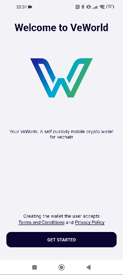
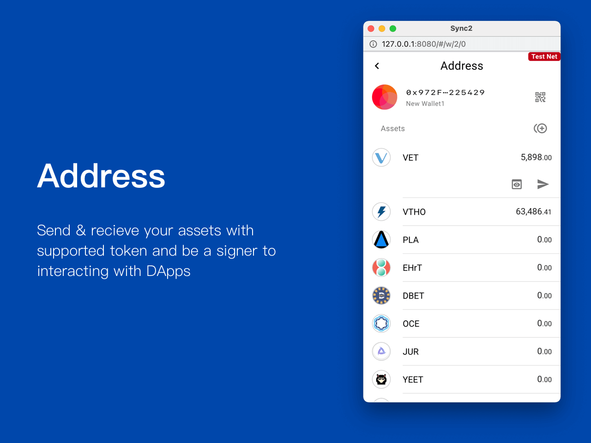

# Wallet

## Create a new wallet



 

<figure><figcaption></figcaption></figure>

  

    <svg aria-hidden="true" height="16" viewBox="0 0 16 16" version="1.1" width="16" data-view-component="true" class="octicon octicon-device-camera-video">
    <path d="M16 3.75v8.5a.75.75 0 0 1-1.136.643L11 10.575v.675A1.75 1.75 0 0 1 9.25 13h-7.5A1.75 1.75 0 0 1 0 11.25v-6.5C0 3.784.784 3 1.75 3h7.5c.966 0 1.75.784 1.75 1.75v.675l3.864-2.318A.75.75 0 0 1 16 3.75Zm-6.5 1a.25.25 0 0 0-.25-.25h-7.5a.25.25 0 0 0-.25.25v6.5c0 .138.112.25.25.25h7.5a.25.25 0 0 0 .25-.25v-6.5ZM11 8.825l3.5 2.1v-5.85l-3.5 2.1Z"></path>
</svg>
    DAppDemo.mov
    
  

  <video src="https://private-user-images.githubusercontent.com/150018882/309203051-5cc133ae-4c6b-4e08-8cff-0e09b6ca43aa.mov?jwt=eyJhbGciOiJIUzI1NiIsInR5cCI6IkpXVCJ9.eyJpc3MiOiJnaXRodWIuY29tIiwiYXVkIjoicmF3LmdpdGh1YnVzZXJjb250ZW50LmNvbSIsImtleSI6ImtleTUiLCJleHAiOjE3MTI5MDMwMDcsIm5iZiI6MTcxMjkwMjcwNywicGF0aCI6Ii8xNTAwMTg4ODIvMzA5MjAzMDUxLTVjYzEzM2FlLTRjNmItNGUwOC04Y2ZmLTBlMDliNmNhNDNhYS5tb3Y_WC1BbXotQWxnb3JpdGhtPUFXUzQtSE1BQy1TSEEyNTYmWC1BbXotQ3JlZGVudGlhbD1BS0lBVkNPRFlMU0E1M1BRSzRaQSUyRjIwMjQwNDEyJTJGdXMtZWFzdC0xJTJGczMlMkZhd3M0X3JlcXVlc3QmWC1BbXotRGF0ZT0yMDI0MDQxMlQwNjE4MjdaJlgtQW16LUV4cGlyZXM9MzAwJlgtQW16LVNpZ25hdHVyZT0xMzAyOGY0ZjYwNmMxZjRiMTJkMmUzMmMxMTY5N2Y1ODIzM2E2Y2Q0ZjAxMTRmNGM1M2JjZmExYWYwMTJkOTU1JlgtQW16LVNpZ25lZEhlYWRlcnM9aG9zdCZhY3Rvcl9pZD0wJmtleV9pZD0wJnJlcG9faWQ9MCJ9.yzhKCRfGu3LWxlgPfyFKlTGSXR5KiuuGTqXBwLvvKVk" data-canonical-src="https://private-user-images.githubusercontent.com/150018882/309203051-5cc133ae-4c6b-4e08-8cff-0e09b6ca43aa.mov?jwt=eyJhbGciOiJIUzI1NiIsInR5cCI6IkpXVCJ9.eyJpc3MiOiJnaXRodWIuY29tIiwiYXVkIjoicmF3LmdpdGh1YnVzZXJjb250ZW50LmNvbSIsImtleSI6ImtleTUiLCJleHAiOjE3MTI5MDMwMDcsIm5iZiI6MTcxMjkwMjcwNywicGF0aCI6Ii8xNTAwMTg4ODIvMzA5MjAzMDUxLTVjYzEzM2FlLTRjNmItNGUwOC04Y2ZmLTBlMDliNmNhNDNhYS5tb3Y_WC1BbXotQWxnb3JpdGhtPUFXUzQtSE1BQy1TSEEyNTYmWC1BbXotQ3JlZGVudGlhbD1BS0lBVkNPRFlMU0E1M1BRSzRaQSUyRjIwMjQwNDEyJTJGdXMtZWFzdC0xJTJGczMlMkZhd3M0X3JlcXVlc3QmWC1BbXotRGF0ZT0yMDI0MDQxMlQwNjE4MjdaJlgtQW16LUV4cGlyZXM9MzAwJlgtQW16LVNpZ25hdHVyZT0xMzAyOGY0ZjYwNmMxZjRiMTJkMmUzMmMxMTY5N2Y1ODIzM2E2Y2Q0ZjAxMTRmNGM1M2JjZmExYWYwMTJkOTU1JlgtQW16LVNpZ25lZEhlYWRlcnM9aG9zdCZhY3Rvcl9pZD0wJmtleV9pZD0wJnJlcG9faWQ9MCJ9.yzhKCRfGu3LWxlgPfyFKlTGSXR5KiuuGTqXBwLvvKVk" controls="controls" muted="muted" class="d-block rounded-bottom-2 border-top width-fit" style="max-height:640px; min-height: 200px">
  </video>

<video width="320" height="240" controls>
  <source src="https://www.w3schools.com/html/mov_bbb.mp4" type="video/mp4">
Your browser does not support the video tag.
</video>











## Import a wallet

### Import from Mnemonic

### Import from Private Key

### Import from KeyStore

### Import from Ledger

## Export a wallet

## Manage your wallets

## Wallet list 

All the wallets will be shown in  wallet list.


If it is a Ledger wallet, you can identify the wallet by the presence of the 


## New Wallet 

### Generate 

1. Click upper left  to open wallet list
2. Click the upper area  to new wallet page
3. Click **Generate**
4. Verification
   1. Password: Enter your password to authorize the generation
   2. Biometric authentication:
      1. Facial recognition: hold your device in portrait orientation, then glance at it.
      2. Fingerprint recognition: place your finger on fingerprint scanner


Mobile - Long press the **Generate**

Desktop - Right click the **Generate**


### Import 

1. Click upper left  to open wallet list
2. Click the upper area  to new wallet page
3. Click **Import**
4. Enter your mnemonic words
5. Enter your password to authorize the import

### Link Ledger device 

1. Click upper left  to open wallet list
2. Click the upper area  to new wallet page
3. Click **Link Now**
4. Connect and unlocked your Ledger device
5. Click **Link**

### Wallet name 

By default, we use "New Wallet" as the name for each new wallet. You can easily change the name by editing the input text field.

### Custom network wallet 


Before adding the custom network wallet, you need to [#add-node](settings.md#add-node "mention") beforehand


1. Click upper left  to open wallet list
2. Click the upper area  to open the new wallet page
3. Click upper right 
4. Select **Private**
5. Click **Import** / **Generate**

## Backup wallet 

The mnemonic words store all the information that is needed at any point in time to recover your wallet. The mnemonic words should be **stored in a secure place**. It ensures you have had a backup in a scenario where your device breaks down or becomes unusable due to any reason. In such cases, all you need is your mnemonic words to recover the wallet.

1. Click **Backup Now** on the banner
2. Backup manually
   1. Click on upper right 
   2. Click **Backup**


* Once you've backed up the wallet or wallet is imported, the backup banner won't be shown, you can try to back up manually
* Ledger wallet mnemonic words are managed by Ledger itself. therefore, you will not be able to back up your device via Sync2


## Rename wallet 

Wallet name is the identifier to help you easily tell the wallet.

1. Click upper right 
2. Click **Rename**
3. Enter the name of your wallet
4. Click **Confirm**

## Delete wallet 

1. Click upper right 
2. Click **Delete**
3. Follow the instructions to continue the deletion
4. Click **Delete**
5. Enter your password to authorize the deletion

## Create new address 

1. Click upper right 
2. Click **New Address**


A user is limited to a maximum of 10 addresses.


## Address 

<figure><figcaption></figcaption></figure>

### Add assets 

1. Click middle right 
2. Choose the token from the token list
3. Toggle on to enable

### Transfer history 

1. Click the asset you would like to check the history
2. Click  to check the details

### Send asset 

1. Click the asset you would like to send
2. Click  to send asset

### Receive asset 

1. At the upper right
2. Click  to view the QR Code or copy address
