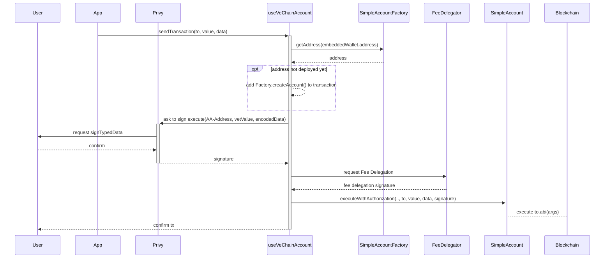

# PWA with Privy and Account Abstraction

## Objectives

The goal of this tutorial is to:

* Implement Privy's template to create a PWA that runs a Next.js application using their embedded wallets.
* Adjust the application to sign and submit transactions for an Account Abstraction Wallet.

## Prerequisites

Before starting this tutorial, you should have a good understanding of the following:

* React: You need to know how to code with React as this tutorial involves creating a PWA using Next.js, which is based on React.
* Hardhat: You should be familiar with deploying smart contracts using Hardhat.
* Fee Delegation: Understanding fee delegation, especially in the context of VeChain, is crucial for implementing Account Abstraction Wallets.

## Privy

### Introduction

Privy is a service that provides authentication services, which most users use daily, to access web3 wallets.

Privy handles wallet generation, security aspects, and interfaces that manage the signing of transactions or messages.

### Setup

Privy offers a setup guide in a template project on GitHub:\
[https://github.com/privy-io/create-privy-pwa](https://github.com/privy-io/create-privy-pwa)

The steps to be done are:

#### Clone Template

```shell
npx degit privy-io/create-privy-pwa my-pwa-project
```

#### Install Dependencies

Run `npm install` to install the project required dependencies:

```shell
cd my-pwa-project
npm install
```

#### Configure Privy

Visit [https://privy.io](https://privy.io) to create a new App.

Create the file `.env` and add your created App Id:

```shell
NEXT_PUBLIC_PRIVY_APP_ID=
```

### Start App

You can start the app with `npm run dev`, and you will be able to sign into the app.

> For testing development, its recommend to use `ngrok` ([guide](https://www.aleksandrhovhannisyan.com/blog/test-localhost-on-mobile/)), since privy makes use of [crypto.subtle](https://developer.mozilla.org/en-US/docs/Web/API/Crypto/subtle) which requires a secure context (`https`).

### Login Methods

To adjust the desired login methods, toggle them on or off in the Privy dashboard for the app at: [https://dashboard.privy.io](https://dashboard.privy.io)

## Account Abstraction

### Introduction

Account Abstraction is a standard that allows smart contracts to initiate transactions, providing an on-chain wallet that can replace an externally owned account (EOA).

Example projects using this standard are available on GitHub at:

* [https://github.com/vechain/account-abstraction](https://github.com/vechain/account-abstraction)
* [https://github.com/eth-infinitism/account-abstraction](https://github.com/eth-infinitism/account-abstraction)

### Setup

For the purpose of this tutorial, the account abstraction contracts from the `SimpleAccount` example by `eth-infinitism` are used.

The contracts to be deployed are:

* [`core/EntryPoint.sol`](https://github.com/eth-infinitism/account-abstraction/blob/develop/contracts/core/EntryPoint.sol)
* [`samples/SimpleAccountFactory.sol`](https://github.com/eth-infinitism/account-abstraction/blob/develop/contracts/samples/SimpleAccountFactory.sol)
* [`samples/SimpleAccount.sol`](https://github.com/eth-infinitism/account-abstraction/blob/develop/contracts/samples/SimpleAccount.sol)

To simplify the process, a modified project is available on GitHub at:\
https://github.com/vechain-energy/example-pwa-privy-account-abstraction/tree/main/account-abstraction-contracts

#### Clone Contracts

```shell
git clone https://github.com/vechain-energy/docs-pwa-privy-account-abstraction-my-pwa-project.git
```

#### Install Dependencies

Run `npm install --legacy-peer-deps` to install the project required dependencies:

```shell
cd docs-pwa-privy-account-abstraction/account-abstraction-contracts/
npm install --legacy-peer-deps
```

#### Configure Network

Generate a new private key and create the file `.env`, to configure it as deployer:

```shell
PRIVATE_KEY=0x...
```

A simple way to generate a private key can be `openssl`:

```shell
echo "PRIVATE_KEY=0x$(openssl rand -hex 32)" > .env
```

Optionally adjust more network related options in the `hardhat.config.ts` file.

#### Deploy Contracts

The deploy scripts are in the `deploy/` folder. Inspect for further understanding.

Use the hardhat deploy plugin to deploy the example contracts:

```shell
npx hardhat deploy --network vechain_testnet
```

The output of the command shows the addresses of the deployed contracts:

```shell
Generating typings for: 44 artifacts in dir: typechain-types for target: ethers-v6
Successfully generated 132 typings!
Compiled 46 Solidity files successfully (evm target: paris).
deploying "EntryPoint" (tx: 0x0b8df7637c4070630551b3c4701b2190e9882698d280a34b4a2632a9a7a3f0d5)...: deployed at 0x6cc1324CBeF466E61936792dD4D7C0F3eBe703d1 with 4042403 gas
==entrypoint addr= 0x6cc1324CBeF466E61936792dD4D7C0F3eBe703d1
deploying "SimpleAccountFactory" (tx: 0x73ead176308248932ff8b367db9c882a050e05b79ec18801fdaa261998d59744)...: deployed at 0x07AD1BF374251A5712D190196ED2fa58FC344caf with 2834689 gas
d54abce22180746e5f530a)...: deployed at 0x41Ea0cDa1471d70961bdc81bB9203a09cbf9B65e with 2503344 gas
```

The deployment addresses and ABIs are archived in the `deployments/vechain_testnet` folder.

Please document the address of the deployed `SimpleAccountFactory` for future use. In the above example output, it is `0x41Ea0cDa1471d70961bdc81bB9203a09cbf9B65e`.

### Background: Accept Signed Executions

The `SimpleAccount` restricts access to its owner or the endpoint contract.

Because Privy does not support the VeChain network, the interaction will be based on signed messages. A new function `executeWithAuthorization` verifies a signature for an execution to be from the owner.

You can add yourself a signature verification to `SimpleAccount.sol` with these changes:

```solidity
import "@openzeppelin/contracts/utils/cryptography/EIP712.sol";
```

Call the EIP721 with the constructor by adjusting its definition:

```solidity
    constructor(IEntryPoint anEntryPoint) EIP712("Wallet", "1") {
```

And add a new function that verifies signatures and does the same as `execute`:

```solidity
/**
 * execute a transaction (called directly from owner, or by entryPoint) authorized via signatures

 * @param to destination address to call
 * @param value the value to pass in this call
 * @param data the calldata to pass in this call
 * @param validAfter unix timestamp after which the signature will be accepted
 * @param validBefore unix timestamp until the signature will be accepted
 * @param signature the signed type4 signature
 */
function executeWithAuthorization(
    address to,
    uint256 value,
    bytes calldata data,
    uint256 validAfter,
    uint256 validBefore,
    bytes calldata signature
) external payable {
    require(block.timestamp > validAfter, "Authorization not yet valid");
    require(block.timestamp < validBefore, "Authorization expired");

    /**
        * verify that the signature did sign the function call
        */
    bytes32 structHash = keccak256(
        abi.encode(
            keccak256(
                "ExecuteWithAuthorization(address to,uint256 value,bytes data,uint256 validAfter,uint256 validBefore)"
            ),
            to,
            value,
            keccak256(data),
            validAfter,
            validBefore
        )
    );
    bytes32 digest = _hashTypedDataV4(structHash);

    address recoveredAddress = ECDSA.recover(digest, signature);
    require(recoveredAddress == owner, "Invalid signer");

    // execute the instruction
    _call(to, value, data);
}
```

## Implement Account Abstraction into Privy PWA

### Configure Account Abstraction and VeChain

Extend the `.env` file with the following lines:

```shell
NEXT_PUBLIC_AA_FACTORY=0x41Ea0cDa1471d70961bdc81bB9203a09cbf9B65e
NEXT_PUBLIC_NODE_URL=https://testnet.vechain.org
NEXT_PUBLIC_DELEGATOR_URL=https://sponsor-testnet.vechain.energy/by/90
```

* `NEXT_PUBLIC_AA_FACTORY` is the address of the previously deployed `SimpleAccountFactory`
* `NEXT_PUBLIC_NODE_URL` is the link to the VeChain network to use.
* `NEXT_PUBLIC_DELEGATOR_URL` is a fee delegation service, that will pay the VTHO gas fees. Visit [vechain.energy](https://vechain.energy) to create one or [build one yourself](https://favo.gitbook.io/docs.vechain.org/start-building/tutorials/how-to-build-on-vechain/write-data/fee-delegation).

### Install VeChain Dependencies

Install the VeChain SDK to simplify interaction with the VeChain network:

```shell
npm install  --save @vechain/sdk-core@1.0.0-beta.16 @vechain/sdk-network@1.0.0-beta.16
```

### `useVeChainAccount.tsx`

A prepared hook will provide connectivity to the Account Abtractions deployment.

Copy [`useVeChainAccount.tsx`](https://github.com/vechain-energy/example-pwa-privy-account-abstraction/blob/main/my-pwa-project/lib/useVeChainAccount.tsx) into the `components/lib` folder.

### Background: How the Hook Works

The hook internally performs the following steps:

1. Generates a random wallet for blockchain interaction, providing an entry point into the network from which transactions can be accepted.
2. Requests the user to sign a typed message with the Privy embedded wallet.
3. If the SimpleAccount does not exist yet, it injects a clause to deploy a new SimpleAccount first.
4. Builds a transaction to interact with the Account Abstraction Wallet.
5. Requests the Gas Fee Payment from a Fee Delegator to avoid funding the random wallet with VTHO.
6. Sends the transaction to the VeChain Network.
7. Returns the transaction ID.

The visualized process is:



#### Add `VeChainAccountProvider`

Add the `VeChainAccountProvider` into the `pages/_app.tsx` to wrap the application components.

`VeChainAccountProvider` is a React Context provider that does the following:

1. Creates a new ThorClient to connect to the VeChain Network.
2. Identifies the address of the embedded Privy wallet.
3. Loads the `SimpleAccount` address from the `SimpleAccountFactory` identified by the user's embedded Privy address.
4. Exports the address, a function to send transactions, and some generic network/connectivity information.

The file after modification looks like this:

```tsx
import type { AppProps } from 'next/app'
import Meta from '@/components/meta'
import '@/styles/globals.css'
import { PrivyProvider } from '@privy-io/react-auth'
import { VeChainAccountProvider } from '@/lib/useVeChainAccount'

const App = ({ Component, pageProps }: AppProps) => {
	return (
		<PrivyProvider
			appId={process.env.NEXT_PUBLIC_PRIVY_APP_ID as string}
			config={{
				loginMethods: ['sms', 'apple', 'google'],
				embeddedWallets: {
					createOnLogin: 'all-users',
				},
			}}
		>
			<Meta />
			<VeChainAccountProvider
				nodeUrl={process.env.NEXT_PUBLIC_NODE_URL as string}
				delegatorUrl={process.env.NEXT_PUBLIC_DELEGATOR_URL as string}
				accountFactory={process.env.NEXT_PUBLIC_AA_FACTORY as string}
			>
				<Component {...pageProps} />
			</VeChainAccountProvider>
		</PrivyProvider>
	)
}

export default App
```

#### Use `useVeChainAccount`

Import the `useVeChainAccount` hook into `pages/embedded-wallet.tsx` and call it within the component:

```tsx
const vechain = useVeChainAccount()
```

### Display Address

The address exported from the `useVeChainAccount` hook is the address from which future transactions will originate.

Add the following snippet to display the account address in the `embedded-wallet.tsx`:

<pre class="language-tsx"><code class="lang-tsx"><strong>&#x3C;Section>
</strong>    &#x3C;p className='text-md mt-2 font-bold uppercase text-gray-700'>
        Your VeChain Address
    &#x3C;/p>
    &#x3C;textarea
        value={vechain.address}
        className='mt-4 h-12 w-full rounded-md bg-slate-700 p-4 font-mono text-xs text-slate-50 disabled:opacity-25'
        rows={1}
        readOnly
    />
&#x3C;/Section>
</code></pre>

### Configure Test Call

To test an interaction, replace the existing test transfer with a call to `vechain.sendTransaction`.

Replace the `onTransfer` function in `embedded-wallet.tsx` with the following code:

```tsx
const onTransfer = async () => {
    if (!vechain.address) return
    try {
        setTxIsLoading(true)
        const _txHash = await vechain.sendTransaction({
            to: recipientAddress as `0x${string}`,
            value: parseEther('0.004'),
        })
        setTxHash(_txHash)
    } catch (e) {
        console.error('Transfer failed with error ', e)
        setTxIsLoading(false)
    }
}
```

### Test the PWA

Open two terminals to run the application and create a public `https` endpoint:

* Run `npm run dev` to start the PWA application.
* Run `ngrok http 3004` to start an ngrok proxy and get a public secure address.

Switch to your browser:

* Open the forwarding address shown by `ngrok`.
* Log in with your social account.
* Switch to the `Embedded Wallet` menu.

### Fund VeChain Wallet

Visit [faucet.vecha.in](https://faucet.vecha.in/) to claim VET on the TestNet and send 1 VET to the VeChain address shown in your PWA.

### Test Transactions

In your PWA, enter a valid address for the transfer and test the Transfer function. A dialog will open and request to sign a transaction. Once signed, the `SimpleAccount` will transfer `0.004 VET` to the entered address.

### Interact with Smart Contracts

To interact with other smart contracts, `sendTransaction` accepts `to`, `data`, and `value` parameters like other similar functions.

Either pass in the data for the smart contract call encoded or pass the data as an object, which will then be used to call `encodeFunctionData` within the `useVeChainAccount` hook.

For example:

```tsx
const _txHash = await vechain.sendTransaction({
    to: '0x8384738C995D49C5b692560ae688fc8b51af1059',
    value: 0,
    data: {
        abi: [{
            "inputs": [],
            "name": "increment",
            "outputs": [],
            "type": "function"
        }],
        functionName: "increment",
        args: []
    },
})
```

## Hide Transaction Signing

Signing messages or transactions can be complex and a hurdle for regular users. To reduce friction, you can disable the signing dialog in the Privy Dashboard under `Embedded Wallets > Add confirmation modals`.

Disabling this option allows the application to instantly interact with the blockchain, improving the user experience. Pending transactions can be managed with loading animations.

## Conclusion

In this article, we've created a way of adding VeChain support within the Privy demo project by creating an Account Abstraction Factory that serves as the interaction source.

By using Fee Delegation, the gas fees are covered for the user, eliminating the need to ask the user to fund it with VTHO first.

An example application for further exploration of Account Abstractions and a Privy PWA is available on GitHub at [docs-pwa-privy-account-abstraction-my-pwa-project](https://github.com/vechain-energy/docs-pwa-privy-account-abstraction-my-pwa-project).

You can use the information to either build on top of the example project and hook or derive your own process.
