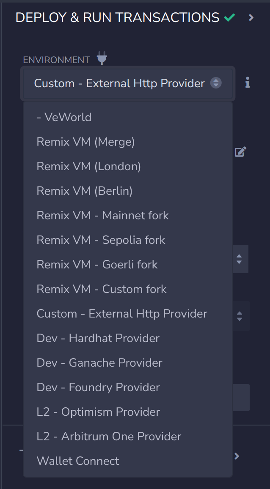
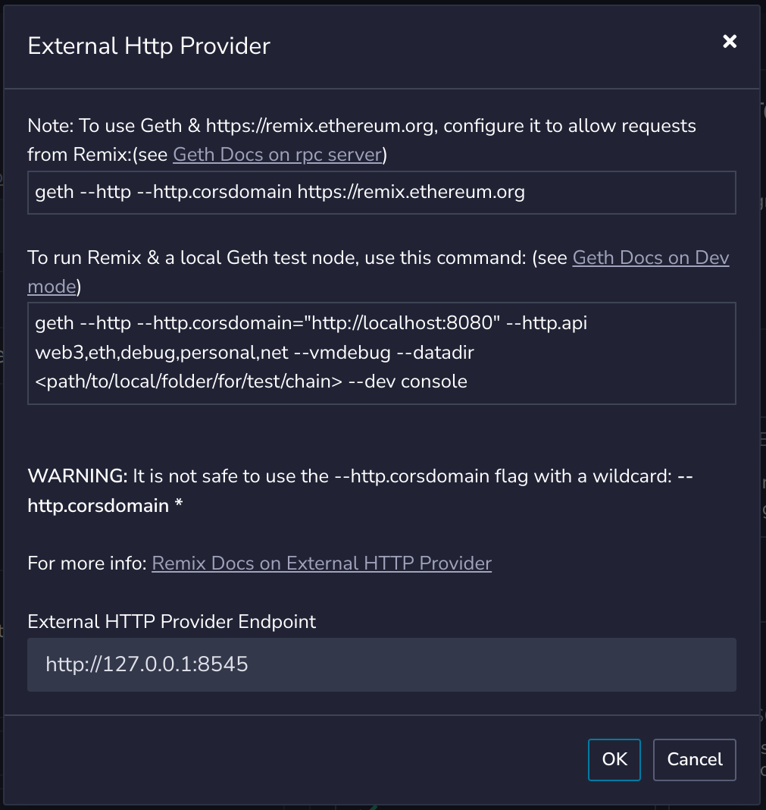

# Remix

[Remix](https://remix-project.org/) is a comprehensive, web-based integrated development environment (IDE) for smart contract creation and deployment. It caters to developers of all skill levels, serving as both a powerful toolset for the entire contract development lifecycle and an educational platform for learning and experimenting with Ethereum-based technologies.

Our VeChain integration with Remix enables our community to leverage this robust IDE when developing smart contracts and decentralized applications (dApps) on the VeChain blockchain. By providing an RPC proxy, we've made it possible for VeChain developers to seamlessly use Remix's feature-rich environment while targeting the VeChain network, combining the familiarity of Ethereum development tools with the unique advantages of the VeChain ecosystem.

## RPC Proxy

The RPC Proxy is designed to bridge the gap between Thor's RESTful API and Ethereum's JSON-RPC, enabling seamless interaction with the VeChainThor blockchain through RPC calls. It is particularly useful for integrating with tools such as the Remix IDE.

## Installation

To install the RPC proxy, use the following command:

```bash
yarn add @vechain/sdk-rpc-proxy
```

By default, the proxy is configured to be used with a solo node running on your local machine. There are two options if you want to change the default behavior, or use a custom configuration:

* Create a config.json file and pass it to the command when launching the RPC Proxy.
* Use CLI options.

## CLI Options

With rpc-proxy, you can use the following CLI options. CLI options override the configuration file. So you can run the rpc-proxy with:

* a configuration file with the default values and override them with the cli options
  * -e.g.- `npx rpc-proxy -p 8545 -v ...`
* a custom configuration file and override some values with the cli options
  * -e.g.- `npx rpc-proxy -c /path/of/custom-config.json -p 8545 -v ...`

### CLI options list

#### Provide the configuration file

- `-c, --configurationFile <config>`: The path to the configuration file.
    - -e.g.- `npx rpc-proxy -c /path/of/custom-config.json` OR `rpc-proxy --configurationFile custom-config.json`

- `-p, --port <port>`: The port on which the proxy server will run.
    - -e.g.- `npx rpc-proxy -p 8545` OR `rpc-proxy --port 8545`

- `-u, --url <url>`: The URL of the VeChain Thor node.
    - -e.g.- `npx rpc-proxy -u http://testnet.vechain.org` OR `rpc-proxy --url http://testnet.vechain.org`

- `-v, --verbose`: Whether to enable verbose logging.
    - -e.g.- `npx rpc-proxy -v` OR `rpc-proxy --verbose`

#### Provide the accounts

- `-a, --accounts <accounts>`: The accounts (private keys) that the proxy server will use to sign transactions. It is a
  space-separated list of private keys.
    - -e.g.- `npx rpc-proxy -a "7f9290cc44c5fd2b95fe21d6ad6fe5fa9c177e1cd6f3b4c96a97b13e09eaa158 8f9290cc44c5fd2b95fe21d6ad6fe5fa9c177e1cd6f3b4c96a97b13e09eaa158"`
    OR `npx rpc-proxy --accounts "7f9290cc44c5fd2b95fe21d6ad6fe5fa9c177e1cd6f3b4c96a97b13e09eaa158 8f9290cc44c5fd2b95fe21d6ad6fe5fa9c177e1cd6f3b4c96a97b13e09eaa158"`

- `-m, --mnemonic <mnemonic>`: The mnemonic that the proxy server will use to sign transactions.
- `-mc, --mnemonicCount <mnemonicCount>`: The number of accounts to derive from the mnemonic.
- `-mi, --mnemonicInitialIndex <mnemonicInitialIndex>`: The index from which to start deriving accounts from the
  mnemonic.
    - -e.g.- `npx rpc-proxy -m "denial kitchen pet squirrel other broom bar gas better priority spoil cross" -mc 10 -mi 1`
      OR `npx rpc-proxy --mnemonic "denial kitchen pet squirrel other broom bar gas better priority spoil cross" --mnemonicCount 10 --mnemonicInitialIndex 1`
    - **NOTE**: --mnemonic, --mnemonicCount, and --mnemonicInitialIndex MUST be used together.

#### Use delegation

- `-e, --enableDelegation`: Whether to enable delegation.
- `-dp, --gasPayerPrivateKey <gasPayerPrivateKey>`: The private key of the gasPayer.
- `-du, --gasPayerUrl <gasPayerUrl>`: The URL of the gasPayer.
    - -e.g.- `npx rpc-proxy -e -dp 8f9290cc44c5fd2b95fe21d6ad6fe5fa9c177e1cd6f3b4c96a97b13e09eaa158`
      OR `npx rpc-proxy --enableDelegation --gasPayerPrivateKey 8f9290cc44c5fd2b95fe21d6ad6fe5fa9c177e1cd6f3b4c96a97b13e09eaa158`
    - -e.g.- `npx rpc-proxy -e -du https://sponsor-testnet.vechain.energy/by/...`
      OR `npx rpc-proxy --enableDelegation --gasPayerUrl https://sponsor-testnet.vechain.energy/by/...`
    - **NOTE**: --gasPayerPrivateKey and --gasPayerUrl are mutually exclusive.
    - **NOTE**: if --enableDelegation is used, --gasPayerPrivateKey OR --gasPayerUrl MUST be used.

## Configuration file

Create a `config.json` with your desired settings. The configuration file includes the following fields:

* `url`: The URL of the VeChain Thor node.
* `port`: The port of the proxy server.
* `accounts`: The accounts that the proxy server will use to sign transactions (can be a mnemonic or an array of private keys).
* `verbose`: Wheter to enable verbose logging.
* `debug`: Whether to enable debug mode.
* `enableDelegation`: Whether to enable delegation.

After creating your configuration file, run the proxy using one of the following commands:

```bash
rpc-proxy -c <json config file>
```

Or:

```bash
rpc-proxy --configurationFile <json config file>
```

### Example Configuration

```json
{
    "url": "http://127.0.0.1:8669",
    "port": 8545,
    "accounts": {
        "mnemonic": "denial kitchen pet squirrel other broom bar gas better priority spoil cross",
        "count": 10
    },
    "verbose": true,
    "enableDelegation": false
}
```

If you are launching the RPC Proxy with the provided example configuration, make sure to have Thor running locally in solo mode. Find out more about Thors different options and how to build it [here](https://github.com/vechain/thor).

If you want to use VeChain `testnet` or `mainnet` use the following urls: `https://testnet.vechain.org/` or `https://mainnet.vechain.org/`. and remember also to change the `accounts` field by passing the correct account you want to use.

## Connecting with Remix IDE

#### 1. Go to `DEPLOY & RUN TRANSACTIONS` section

<figure><figcaption></figcaption></figure>

#### 2. Choose Custom - External HTTP provider

<figure><figcaption></figcaption></figure>

#### 3. Choose the URL to your proxy (default is http://127.0.0.1:8545) and click Ok

<figure><figcaption></figcaption></figure>

#### 4. Compile and deploy contracts

<figure><figcaption></figcaption></figure>

#### 5. Interact with contracts via provided interface

<figure><figcaption></figcaption></figure>

## Known Issues and Workaround

Currently there are some limitations when using this proxy. One of them is the fact that when deploying contracts you could get an error of the following type `creation of ContractName errored: [TIMEOUT] Timeout for call deployMetadataOf from udapp`. This usually happens after 3 or more deployments one after another.

Fortunately there is a workaround for this, if all contracts are required in the same workspace. When deploying contracts note their address as well as the contract name. When you get the aforementioned error refresh Remix and recompile the contracts. When navigating to the `DEPLOY & RUN TRANSACTIONS` section instead of re-deploying the contract paste the address in the `AtAddress` section and it will load from your previous deployment. You can now succesfully interact with a previously deployed contract.

<figure><figcaption></figcaption></figure>
