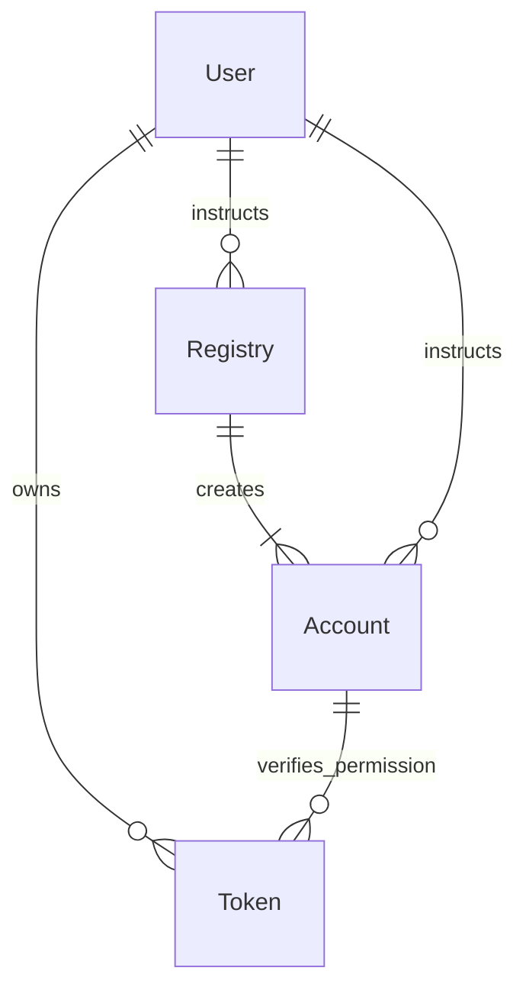

# Token Bound Accounts

## Account

Account abstraction sets up an on-chain wallet that can store assets and act like a regular wallet. With this approach, a crypto wallet becomes a unique smart contract that can be programmed for various purposes.

A single contract with wallet functionality is deployed, controlled by a single owner. The owner is identified by checking the owner of the tokenId at the NFT contract address, both stored in the account during creation.

An example account contract is available on GitHub: [ExampleERC6551Account.sol](https://github.com/vechain/token-bound-accounts/blob/7b41460ca86ac0718703e9f0cd0ca38c0ffa8a87/contracts/examples/ExampleERC6551Account.sol).

## Account Registry

The registry is a helper contract that deploys account contracts and calculates their unique contract address using a tokenId & NFT contract address. It acts like a singleton factory that creates an account only once and returns the same address every time.

The NFT contract address and tokenId linked to the account are provided during account creation and stored in the account for future access verification.

An example registry contract is available on GitHub: [ERC6551Registry.sol](https://github.com/vechain/token-bound-accounts/blob/7b41460ca86ac0718703e9f0cd0ca38c0ffa8a87/contracts/ERC6551Registry.sol).

### Creating an Account

During NFT minting, the Registry can be instructed to create a new Account. The account will only be created once:

```sol
IERC6551Registry("0x_<Registry-Deployment>")
    .createAccount(
        "0x_<Account-Deployment>",
        block.chainid,
        "0x_<NFT-Deployment>",
        tokenId,
        salt,
        ""
    );
```

The account creation can also be delayed, to only create it when required.

### Getting an Account's Address

Using the `account()` function, the same address will always be calculated, allowing you to know an address even before the wallet is deployed.

```sol
IERC6551Registry("0x_<Registry-Deployment>")
    .account(
        "0x_<Account-Deployment>",
        block.chainid,
        "0x_<NFT-Deployment>",
        tokenId,
        salt
    );
```

### Account Interaction

Using the address and the account interface, the account can be instructed using the `execute()` function:

```sol
ExampleERC6551Account("0x_<Account Address>")
    .execute(
        "0x_<recipient/to address>",
        vetBalanceToTransferOr0,
        encodedData,
        0
    )
```

For example, transferring VTHO and 0 VET:

```ts
TBA.execute(
    // VTHO Address
    "0x0000000000000000000000000000456e65726779",
    
    // VET Value to transfer
    0,
    
    // Instructions on the recipient
    vtho.interface.encodeFunctionData("transfer", [owner, vthoAmount]),
    
    // must be 0 in the example contract
    0
)
```

## NFT

The NFT contract is a basic OpenZeppelin template. Its address and tokenId provide proof of ownership.

An example contract can be generated with OpenZeppelin as ERC721 on [https://wizard.openzeppelin.com/#erc721](https://wizard.openzeppelin.com/#erc721).

### Account Ownership

Ownership in the example account is possible because, during account creation, the address of the NFT contract and the corresponding tokenId are stored within the account.

Using this information, the account will verify ownership using the `ownerOf()` functionality on the NFT contract:

```sol
IERC721(tokenContract).ownerOf(tokenId);
```

## Example

An example project showing all elements connected into a single Hardhat project is available on GitHub at [example-token-bound-accounts](https://github.com/vechain-energy/example-token-bound-accounts/tree/main).


